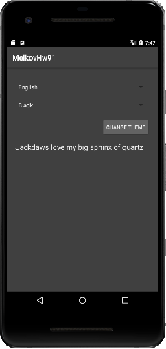

## Задача №1
### Переключение цветов в приложении
**Задание:**

Среди пользователей приложений у всех разные вкусы. Хорошее приложение должно иметь варианты изменения дизайна под каждого пользователя.

Возьмите домашнее задание “Переключение языка” из занятия 3.3. Добавьте на экран переключения языков следующие элементы:

Spinner с выбором цветов — “черный, зеленый и синий”.
Кнопка ОК — по клику на кнопку во всем приложении меняется цветовая тема.
Необходимо создать 3 цветовых темы для приложения - в черных, зеленых или синих тонах, применяемых к цвету всех элементов.

